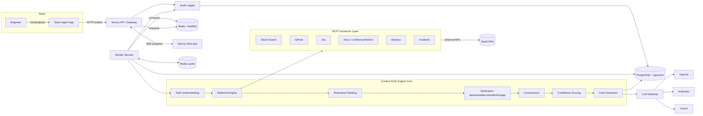

# 02 — Information, Data & System Architecture + API Design

- [6. Information Architecture](#6-information-architecture)
- [7. Database Design](#7-database-design)
- [8. System Architecture](#8-system-architecture)
- [9. Backend Architecture](#9-backend-architecture)
- [10. Frontend Architecture](#10-frontend-architecture)
- [11. API Design](#11-api-design)

---

## 6. Information Architecture

### 6.1 Core domain objects

```
Task ──1:1── ContextJob ──1:1── ContextPack
                  │                    │
                  │ 1:N                │ 1:N
            RetrievedItem ───────► PackItem (ranked, verified, summarized, sectioned)
                  │
                  │ clusters into
            DuplicateCluster
ContextPack ──1:N── Contradiction
ContextPack ──1:N── MissingInfo
ContextPack ──1:1── ConfidenceScore (+ factor breakdown)
ContextJob  ──1:N── AuditEvent
Workspace   ──1:N── Connector ──1:N── (RetrievedItem source)
User        ──1:N── Feedback ──► (ContextPack | PackItem)
LLMSend     ──N:1── ContextPack   (model, budget, status, response ref)
```

### 6.2 The Context Pack (the central artifact)

A Context Pack is a versioned, structured JSON document. Conceptual shape:

```jsonc
{
  "id": "pack_01H...",
  "task": "Investigate why Checkout API is failing",
  "intent": "incident_investigation",
  "entities": ["checkout-api", "payments", "timeout"],
  "timeWindow": { "from": "2026-06-20", "to": "2026-06-27" },
  "confidence": { "score": 62, "factors": { "coverage": 0.7, "agreement": 0.5, "recency": 0.8, "sourceQuality": 0.6, "gapPenalty": -0.15 } },
  "sections": {
    "documents":   [ /* PackItem[] */ ],
    "slackThreads":[ /* PackItem[] */ ],
    "pullRequests":[ /* PackItem[] */ ],
    "jiraTickets": [ /* PackItem[] */ ],
    "deploys":     [ /* PackItem[] */ ],
    "incidents":   [ /* PackItem[] */ ]
  },
  "missingInformation": [ { "requirement": "recent deploy record", "reason": "no deploy connector hit" } ],
  "contradictions": [ { "a": {...}, "b": {...}, "reason": "ownership disagreement" } ],
  "sources": [ /* provenance refs */ ],
  "createdAt": "2026-06-27T...",
  "createdBy": "U123",
  "permalinkSlug": "checkout-api-failing-7f3a"
}
```

A `PackItem`:

```jsonc
{
  "id": "item_...",
  "source": "github",
  "type": "pull_request",
  "title": "Add retry backoff to payments client",
  "summary": "Concise, citation-preserving summary…",
  "url": "https://github.com/...",
  "author": "alice",
  "createdAt": "...", "updatedAt": "...",
  "relevanceScore": 0.81,
  "flags": { "outdated": false, "duplicateOf": null },
  "included": true
}
```

### 6.3 Navigation / UX hierarchy (what the user sees)

```
Slack
 └─ Trigger task ──► Progress message ──► Pack summary card ──► "View full Pack" / "Send to AI"

Web review app (optional)
 └─ Pack page
     ├─ Header: task, confidence (+breakdown), created by/at
     ├─ Section tabs: Documents · Slack · PRs · Jira · Deploys · Incidents
     ├─ Right rail: Missing Information · Contradictions · Sources
     └─ Footer actions: trim items · Send to Claude/GPT/Cursor · Regenerate
 └─ History (past Packs) · Connectors (admin) · Audit (admin)
```

---

## 7. Database Design

**PostgreSQL** is the system of record. **Redis** is cache + queue + pub/sub. **pgvector** holds
embeddings (justification in §8.4). Below is a logical schema (PostgreSQL dialect).

### 7.1 Tables

```sql
-- Tenancy & identity ---------------------------------------------------------
CREATE TABLE workspace (
  id            UUID PRIMARY KEY DEFAULT gen_random_uuid(),
  slack_team_id TEXT UNIQUE NOT NULL,
  name          TEXT NOT NULL,
  created_at    TIMESTAMPTZ NOT NULL DEFAULT now()
);

CREATE TABLE app_user (
  id            UUID PRIMARY KEY DEFAULT gen_random_uuid(),
  workspace_id  UUID NOT NULL REFERENCES workspace(id),
  slack_user_id TEXT NOT NULL,
  email         TEXT,
  display_name  TEXT,
  role          TEXT NOT NULL DEFAULT 'member',   -- member | admin
  UNIQUE (workspace_id, slack_user_id)
);

-- Connectors (tokens stored encrypted; see security) -------------------------
CREATE TABLE connector (
  id            UUID PRIMARY KEY DEFAULT gen_random_uuid(),
  workspace_id  UUID NOT NULL REFERENCES workspace(id),
  kind          TEXT NOT NULL,        -- slack | github | jira | confluence | notion | deploy | incident
  status        TEXT NOT NULL DEFAULT 'active',  -- active | error | disabled
  scopes        TEXT[] NOT NULL DEFAULT '{}',
  token_ref     TEXT NOT NULL,        -- pointer to secret in KMS/secret store, NOT the token
  config        JSONB NOT NULL DEFAULT '{}',
  last_health   TIMESTAMPTZ,
  created_at    TIMESTAMPTZ NOT NULL DEFAULT now()
);

-- Jobs & packs ---------------------------------------------------------------
CREATE TABLE context_job (
  id            UUID PRIMARY KEY DEFAULT gen_random_uuid(),
  workspace_id  UUID NOT NULL REFERENCES workspace(id),
  requested_by  UUID NOT NULL REFERENCES app_user(id),
  task_text     TEXT NOT NULL,
  intent        TEXT,
  entities      JSONB NOT NULL DEFAULT '[]',
  time_window   JSONB,
  status        TEXT NOT NULL DEFAULT 'queued',  -- queued|understanding|retrieving|ranking|verifying|compressing|done|failed|partial
  stage_detail  JSONB NOT NULL DEFAULT '{}',     -- per-stage progress + per-connector counts
  error         TEXT,
  source_channel TEXT,                            -- slack channel/thread for replies
  created_at    TIMESTAMPTZ NOT NULL DEFAULT now(),
  completed_at  TIMESTAMPTZ
);
CREATE INDEX ON context_job (workspace_id, created_at DESC);
CREATE INDEX ON context_job (status);

CREATE TABLE context_pack (
  id              UUID PRIMARY KEY DEFAULT gen_random_uuid(),
  job_id          UUID NOT NULL REFERENCES context_job(id),
  workspace_id    UUID NOT NULL REFERENCES workspace(id),
  permalink_slug  TEXT UNIQUE NOT NULL,
  confidence      INT NOT NULL,                  -- 0..100
  confidence_factors JSONB NOT NULL DEFAULT '{}',
  pack_json       JSONB NOT NULL,                -- denormalized full Pack for fast render
  created_at      TIMESTAMPTZ NOT NULL DEFAULT now()
);
CREATE INDEX ON context_pack (workspace_id, created_at DESC);

-- Retrieved items + embeddings ----------------------------------------------
CREATE TABLE retrieved_item (
  id             UUID PRIMARY KEY DEFAULT gen_random_uuid(),
  job_id         UUID NOT NULL REFERENCES context_job(id),
  source         TEXT NOT NULL,        -- slack|github|jira|...
  external_id    TEXT NOT NULL,
  type           TEXT NOT NULL,        -- message|pull_request|issue|doc|deploy|incident
  title          TEXT,
  body           TEXT,
  url            TEXT,
  author         TEXT,
  source_created_at TIMESTAMPTZ,
  source_updated_at TIMESTAMPTZ,
  content_hash   TEXT,                 -- for exact-dup detection
  relevance      REAL,
  flags          JSONB NOT NULL DEFAULT '{}',  -- {outdated, duplicateOf, clusterId}
  metadata       JSONB NOT NULL DEFAULT '{}',
  embedding      VECTOR(1536),         -- pgvector
  created_at     TIMESTAMPTZ NOT NULL DEFAULT now()
);
CREATE INDEX ON retrieved_item (job_id);
CREATE INDEX ON retrieved_item USING hnsw (embedding vector_cosine_ops);
CREATE INDEX ON retrieved_item (content_hash);

-- Verification outputs -------------------------------------------------------
CREATE TABLE contradiction (
  id            UUID PRIMARY KEY DEFAULT gen_random_uuid(),
  pack_id       UUID NOT NULL REFERENCES context_pack(id),
  item_a        UUID REFERENCES retrieved_item(id),
  item_b        UUID REFERENCES retrieved_item(id),
  claim_a       TEXT, claim_b TEXT,
  reason        TEXT,
  confidence    REAL
);

CREATE TABLE missing_info (
  id            UUID PRIMARY KEY DEFAULT gen_random_uuid(),
  pack_id       UUID NOT NULL REFERENCES context_pack(id),
  requirement   TEXT NOT NULL,
  reason        TEXT
);

-- Sends, feedback, audit -----------------------------------------------------
CREATE TABLE llm_send (
  id            UUID PRIMARY KEY DEFAULT gen_random_uuid(),
  pack_id       UUID NOT NULL REFERENCES context_pack(id),
  model         TEXT NOT NULL,        -- claude-3.x | gpt-4.x | cursor
  token_budget  INT,
  included_items JSONB NOT NULL DEFAULT '[]',
  status        TEXT NOT NULL,        -- sent | answered | error
  response_ref  TEXT,                 -- thread ts / external link
  cost_cents    INT,
  created_at    TIMESTAMPTZ NOT NULL DEFAULT now()
);

CREATE TABLE feedback (
  id            UUID PRIMARY KEY DEFAULT gen_random_uuid(),
  workspace_id  UUID NOT NULL REFERENCES workspace(id),
  user_id       UUID NOT NULL REFERENCES app_user(id),
  target_type   TEXT NOT NULL,        -- pack | item
  target_id     UUID NOT NULL,
  rating        SMALLINT NOT NULL,    -- +1 / -1
  note          TEXT,
  created_at    TIMESTAMPTZ NOT NULL DEFAULT now()
);

-- Append-only audit (no UPDATE/DELETE granted to app role) -------------------
CREATE TABLE audit_event (
  id            BIGSERIAL PRIMARY KEY,
  workspace_id  UUID NOT NULL,
  actor         TEXT,                 -- user or "system"
  job_id        UUID,
  event_type    TEXT NOT NULL,        -- job.created | connector.queried | item.dropped.duplicate | pack.created | llm.sent | ...
  payload       JSONB NOT NULL DEFAULT '{}',
  created_at    TIMESTAMPTZ NOT NULL DEFAULT now()
);
CREATE INDEX ON audit_event (workspace_id, created_at DESC);
CREATE INDEX ON audit_event (job_id);
```

### 7.2 Redis keyspaces

| Key pattern | Purpose | TTL |
|---|---|---|
| `queue:context` (BullMQ) | Job + per-connector subtasks | n/a |
| `job:{id}:progress` (pub/sub channel) | Live stage/progress events → SSE | n/a |
| `cache:conn:{kind}:{hash(query)}` | Connector result cache | 5–15 min |
| `cache:embed:{hash(text)}` | Embedding cache | 24 h |
| `ratelimit:{connector}:{workspace}` | Token-bucket per connector | rolling |
| `idem:{jobKey}` | Idempotency for duplicate triggers | 60 s |

### 7.3 Data-lifecycle notes
- Store **snippets + references**, not full document copies, where the source permits re-fetch.
- `retrieved_item` rows are job-scoped working data; archive/purge per retention policy (e.g., 30–90
  days). `context_pack.pack_json` is the durable artifact.
- `audit_event` is append-only and retained per compliance policy.

---

## 8. System Architecture

### 8.1 High-level component view



### 8.2 Services
- **Web/API (Next.js):** Slack event handler, REST/SSE endpoints, review UI. Stateless.
- **Worker:** long-running pipeline execution via BullMQ. Stateless, horizontally scalable.
- **Connector layer (MCP):** each integration is an MCP-style server/tool with a uniform contract
  (`search`, `fetch`, `health`). New sources are drop-in.
- **PostgreSQL + pgvector:** durable store + vector index.
- **Redis:** queue, cache, pub/sub for progress.
- **LLM Gateway:** provider-agnostic send/format/log.

### 8.3 Why MCP for connectors
MCP gives a standard tool contract so Slack/GitHub/Jira/Docs all look the same to the retrieval
engine, and the *same* connectors can later be exposed directly to external agents (Cursor/Claude).
One integration, two consumers (our engine + downstream AI).

### 8.4 Why a vector DB (pgvector), justified
A vector store is **justified** because three core features need semantic similarity, not keywords:
**(1)** relevance ranking across heterogeneous text, **(2)** near-duplicate clustering, **(3)**
contradiction candidate selection (find semantically-close-but-conflicting pairs). We choose
**pgvector inside PostgreSQL** rather than a separate vector DB to avoid operational sprawl in an
18-day build — one database, transactional consistency between items and their embeddings, and HNSW
indexing is sufficient at this scale. We can graduate to a dedicated vector DB only if scale demands.

---

## 9. Backend Architecture

### 9.1 Pipeline as a staged, resumable workflow
The job is a state machine; each stage is a pure-ish function `(input, ctx) → output` that writes
progress and emits audit events. Stages: `understanding → retrieving → ranking → verifying →
compressing → scoring → generating`. A failure in a non-critical connector marks `partial`, not
`failed`.

### 9.2 Module boundaries (hexagonal / ports-and-adapters)
```
core/                # pure domain logic, no I/O
  task-understanding/
  ranking/
  verification/      # dedupe, staleness, contradiction, gaps (pluggable strategies)
  compression/
  confidence/
  pack/
ports/               # interfaces: ConnectorPort, LLMPort, EmbeddingPort, Store, EventBus
adapters/            # implementations: mcp connectors, openai, anthropic, pg, redis, slack
app/                 # orchestration: job runner, queue wiring, API handlers
```
Benefits: detectors and connectors are swappable; core logic is unit-testable without network.

### 9.3 Concurrency & resilience
- Retrieval fans out with `Promise.allSettled` + per-connector timeout + circuit breaker.
- Token-bucket rate limiting per connector (Redis).
- Caching: connector results (5–15m) and embeddings (24h) keyed by content hash.
- Idempotency keys prevent duplicate jobs from double Slack events.

### 9.4 Verification strategies (how each detector works)
- **Dedupe:** exact via `content_hash`; near via embedding cosine ≥ τ; cluster, pick canonical
  (highest authority/recency), annotate "seen N times."
- **Staleness:** per (source,type) age threshold + "superseded" rule (newer item about same entity).
- **Contradiction:** select semantically-close pairs (vector neighbors) → claim extraction →
  lightweight NLI / LLM judge → record conflict with rationale and both sources.
- **Gaps:** required-info checklist (from task understanding) minus satisfied requirements.

### 9.5 Confidence scoring (transparent formula)
```
score = 100 * clamp(
   w_cov*coverage + w_agree*agreement + w_rec*recency + w_src*sourceQuality - w_gap*gapPenalty,
   0, 1)
```
Weights are config; each factor and the final number are stored so the UI can explain "why 62%."

---

## 10. Frontend Architecture

### 10.1 Surfaces
1. **Slack** (primary): Block Kit messages — progress, Pack summary card, action buttons.
2. **Web review app** (Next.js App Router): full Pack page, history, connectors, audit.

### 10.2 Web app structure
- **Next.js App Router** + React Server Components for data-heavy reads; Client Components for
  interactive Pack editing and live progress.
- **State/data:** TanStack Query for server state; SSE subscription for `job:{id}:progress`.
- **UI:** Tailwind + shadcn/ui; design tokens for an enterprise look; dark/light.
- **Key routes:** `/p/[slug]` (Pack), `/history`, `/connectors`, `/audit`, `/jobs/[id]` (live).
- **Components:** `ConfidenceBadge`, `PackSection`, `PackItemCard`, `ContradictionPanel`,
  `MissingInfoPanel`, `SourceChip`, `SendToAIBar`, `ProgressStream`.

### 10.3 Live progress UX
Worker publishes stage events to Redis → API relays via **SSE** → UI shows a stepper (Gathering →
Ranking → Verifying → Compressing → Done) with per-source counts, matching the brief's "Context
Gathering Progress" flow.

---

## 11. API Design

REST + SSE. JSON. Auth via Slack-signed requests (for Slack endpoints) and session/JWT (web).
All endpoints are workspace-scoped and permission-checked.

### 11.1 Slack-facing
| Method | Path | Purpose |
|---|---|---|
| POST | `/api/slack/events` | Slack Events API (URL verification, mentions). Verifies signature. |
| POST | `/api/slack/commands` | Slash command `/contextpack <task>`; acks < 3s, enqueues job. |
| POST | `/api/slack/interactions` | Block Kit button actions (Send to AI, trim, view). |

### 11.2 Core REST
| Method | Path | Purpose |
|---|---|---|
| POST | `/api/jobs` | Create a context job `{ task, channel? }` → `{ jobId }`. |
| GET | `/api/jobs/:id` | Job status + `stage_detail` (per-connector counts). |
| GET | `/api/jobs/:id/stream` | **SSE** stream of progress events. |
| GET | `/api/packs/:id` | Full Context Pack JSON. |
| GET | `/api/packs/slug/:slug` | Pack by permalink. |
| PATCH | `/api/packs/:id/items` | Include/exclude items before send. |
| POST | `/api/packs/:id/send` | `{ model, includedItemIds }` → send via LLM Gateway. |
| POST | `/api/packs/:id/regenerate` | Re-run with adjusted params. |
| GET | `/api/packs` | History (paginated). |
| POST | `/api/feedback` | `{ targetType, targetId, rating, note }`. |

### 11.3 Admin
| Method | Path | Purpose |
|---|---|---|
| GET | `/api/connectors` | List connectors + health. |
| POST | `/api/connectors/:kind/connect` | Begin OAuth / store PAT (token_ref only). |
| DELETE | `/api/connectors/:id` | Revoke/disconnect. |
| GET | `/api/audit` | Query audit events (admin). |

### 11.4 Representative payloads
```http
POST /api/jobs
{ "task": "Investigate why Checkout API is failing", "channel": "C123", "threadTs": "169..." }
→ 202 { "jobId": "job_01H..." }
```
```http
GET /api/jobs/job_01H.../stream   (text/event-stream)
event: stage   data: {"stage":"retrieving","sources":{"slack":12,"github":4,"jira":2}}
event: stage   data: {"stage":"verifying","duplicatesRemoved":5,"contradictions":1}
event: done    data: {"packId":"pack_01H...","confidence":62}
```
```http
POST /api/packs/pack_01H.../send
{ "model": "claude-3.5-sonnet", "includedItemIds": ["item_a","item_b"] }
→ 200 { "sendId": "...", "status": "answered", "responseRef": "1699...thread" }
```

### 11.5 Conventions
- Idempotency-Key header on POST `/api/jobs` (dedupe Slack retries).
- Cursor pagination (`?cursor=`). RFC-7807 problem+json errors. Rate limited per workspace.
