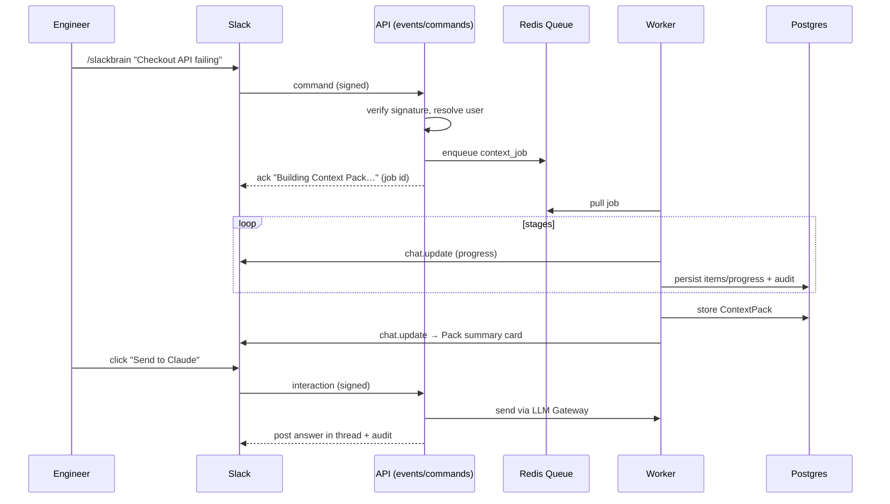

# 03 — Slack Agent Flow, Security & Folder Structure

- [12. Slack Agent Flow](#12-slack-agent-flow)
- [13. Security Considerations](#13-security-considerations)
- [14. Folder Structure](#14-folder-structure)

---

## 12. Slack Agent Flow

### 12.1 Trigger & acknowledgement
Built on the **Slack Agent / Bolt SDK**. The user triggers via slash command
`/slackbrain Investigate why Checkout API is failing`, an @-mention, or a message action.
Slack requires an ack within 3s, so the handler:
1. Verifies the Slack request signature.
2. Resolves workspace + user (creating rows if first-seen).
3. Enqueues a `context_job` and **immediately** replies: *"🧠 Building Context Pack… (job abc123)"*
   with a progress block.

### 12.2 Live progress in Slack
The worker publishes stage events; a Slack updater edits the original message (via `chat.update`)
through the stages, mirroring the brief's progress flow:

```
🧠 Building Context Pack for: "Investigate why Checkout API is failing"
[▓▓▓░░] Retrieving…
 • Slack: 12 threads   • GitHub: 4 PRs   • Jira: 2 issues   • Docs: 3
[▓▓▓▓░] Verifying… removed 5 duplicates, 1 contradiction found
[▓▓▓▓▓] Done — Confidence 62%
```

### 12.3 Pack summary card (Block Kit)
When done, the message becomes a structured card:
- **Header:** task + **Confidence 62%** badge (+ "Why?" overflow → breakdown).
- **Sections (collapsed):** Top Documents, Related Slack Threads, Related PRs, Related Jira, Deploys/Incidents — each item is a link + one-line summary + source chip + ⚠️ if outdated.
- **Missing Information** and **Contradictions** highlighted blocks.
- **Actions row:** `View full Pack` · `Send to Claude` · `Send to GPT` · `Send to Cursor` · `Trim items` · 👍 / 👎.

### 12.4 Interactions
- **Send to AI** → opens optional model picker / confirms → calls `/api/packs/:id/send` → posts the
  model's answer in-thread (Claude/GPT) or returns a Cursor deep link.
- **Trim items** → opens a modal (`views.open`) with checkboxes per item; saved selection updates
  `included` flags before send.
- **Why? (confidence)** → ephemeral message with the factor breakdown.

### 12.5 Permissions & safety in Slack
- Only searches content the **requesting user** is entitled to (Slack Real-Time Search API respects
  user scope where available; otherwise bot-scope with clear disclosure).
- Ephemeral errors for missing connectors ("GitHub not connected — ask an admin").
- All sends are confirmed and audit-logged.

### 12.6 Slack flow (diagram)


---

## 13. Security Considerations

### 13.1 Authentication & authorization
- **Slack:** verify signing secret + timestamp on every request (replay window ≤ 5 min). OAuth 2.0
  install flow; store bot/user tokens encrypted.
- **Web app:** Slack OIDC sign-in → session/JWT; RBAC (`member` vs `admin`); admin-only connector &
  audit routes.
- **Per-user data scoping:** retrieval honors source-side permissions; never return items a user
  can't access. Mark bot-scoped vs user-scoped results clearly.

### 13.2 Secrets & token handling
- Connector tokens stored as `token_ref` pointers to a **KMS / secret manager**, never in app DB or
  logs. Encryption at rest (DB + secrets) and TLS in transit.
- Least-privilege OAuth scopes per connector; show granted scopes in admin UI; support revoke.
- Secret scanning in CI; `.env` never committed; rotate on disconnect.

### 13.3 Data protection & privacy
- **Data minimization:** store snippets + references, re-fetch on demand where possible; configurable
  retention + purge for `retrieved_item`.
- **PII redaction** in logs and before sending to third-party LLMs (configurable redaction pass).
- **Tenant isolation:** every query is workspace-scoped; row-level checks; no cross-workspace reads.
- **LLM egress control:** explicit, audited "Send to AI" — data leaves only on user action; option
  to restrict which providers are allowed per workspace (compliance).

### 13.4 Application security
- Validate/normalize all inputs (Zod schemas at API boundary).
- Rate limiting + abuse protection per workspace/user.
- Output handling: treat retrieved content as untrusted (it can contain prompt-injection). Mitigate
  with content/instruction separation, allow-listed actions, and not auto-executing instructions
  found inside retrieved text.
- Dependency & container scanning; principle of least privilege for the DB app role (no
  `UPDATE/DELETE` on `audit_event`).

### 13.5 Auditability & compliance
- Append-only `audit_event` answers "what did the AI see, and who sent it?" for any Pack.
- Trace IDs propagate Slack→worker→connector→LLM (OpenTelemetry).
- Designed toward SOC2-style controls: access logging, retention config, data minimization,
  encryption, tenant isolation.

### 13.6 Threat model (top risks → mitigations)
| Threat | Mitigation |
|---|---|
| Prompt injection via retrieved content | Treat content as data; separate instructions; no auto-actions; sanitize before LLM |
| Token leakage | KMS-backed secrets, no token logging, least-privilege scopes, rotation |
| Over-broad data access | Per-user permission enforcement, tenant isolation, minimal scopes |
| Data exfiltration to LLMs | Explicit audited send, provider allow-list, PII redaction |
| Slack request forgery / replay | Signature + timestamp verification, idempotency keys |

---

## 14. Folder Structure

Monorepo (pnpm workspaces or Turborepo). Clear split between Next.js app, worker, shared core, and
MCP connectors.

```
context-pack-engine/
├─ apps/
│  ├─ web/                         # Next.js (App Router): UI + API routes
│  │  ├─ app/
│  │  │  ├─ (review)/p/[slug]/page.tsx
│  │  │  ├─ (review)/history/page.tsx
│  │  │  ├─ (admin)/connectors/page.tsx
│  │  │  ├─ (admin)/audit/page.tsx
│  │  │  ├─ jobs/[id]/page.tsx     # live progress
│  │  │  └─ api/
│  │  │     ├─ slack/{events,commands,interactions}/route.ts
│  │  │     ├─ jobs/route.ts
│  │  │     ├─ jobs/[id]/stream/route.ts   # SSE
│  │  │     ├─ packs/[id]/route.ts
│  │  │     ├─ packs/[id]/send/route.ts
│  │  │     ├─ feedback/route.ts
│  │  │     └─ connectors/route.ts
│  │  ├─ components/               # ConfidenceBadge, PackSection, SendToAIBar, ProgressStream…
│  │  ├─ lib/                      # client hooks, query client, sse client
│  │  └─ styles/
│  └─ worker/                      # BullMQ consumer; runs the pipeline
│     └─ src/
│        ├─ index.ts               # queue wiring
│        └─ jobRunner.ts           # stage state machine
│
├─ packages/
│  ├─ core/                        # pure domain logic (no I/O)
│  │  └─ src/
│  │     ├─ task-understanding/
│  │     ├─ ranking/
│  │     ├─ verification/          # dedupe, staleness, contradiction, gaps (strategies)
│  │     ├─ compression/
│  │     ├─ confidence/
│  │     ├─ pack/                  # Pack & PackItem assembly + types
│  │     └─ ports/                 # ConnectorPort, LLMPort, EmbeddingPort, Store, EventBus
│  │
│  ├─ connectors/                  # MCP-style adapters implementing ConnectorPort
│  │  └─ src/{slack,github,jira,docs,deploy,incident}/
│  │
│  ├─ llm-gateway/                 # provider-agnostic send/format/log
│  │  └─ src/{openai,anthropic,cursor,format,router}.ts
│  │
│  ├─ db/                          # Prisma/Drizzle schema, migrations, repositories
│  │  └─ prisma/schema.prisma
│  │
│  ├─ shared/                      # types, zod schemas, config, logger, otel, errors
│  └─ slack-kit/                   # Block Kit builders for progress + Pack card
│
├─ infra/                          # docker-compose (pg+pgvector, redis), env templates, IaC
├─ docs/                           # these design docs
├─ tests/                          # unit (core), integration (connectors mocked), e2e
├─ .github/ or .gitlab-ci.yml      # CI: lint, typecheck, test, build, scan
├─ turbo.json / pnpm-workspace.yaml
├─ package.json
└─ README.md
```

**Rationale:** `packages/core` has zero I/O so detectors and scoring are unit-testable; connectors
and LLM providers are adapters behind ports, making new sources/models drop-in; the worker and web
app share the same core, avoiding logic duplication.
