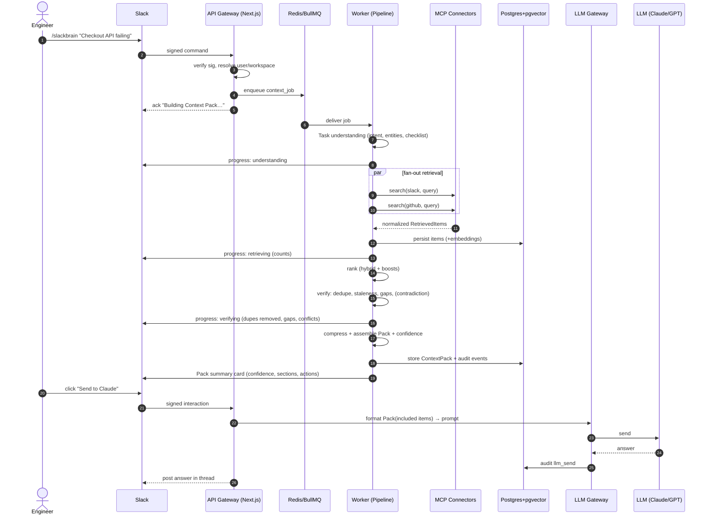
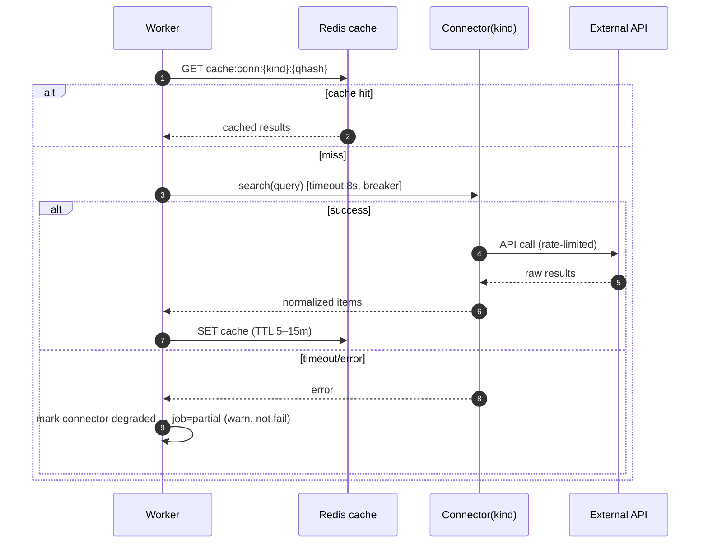
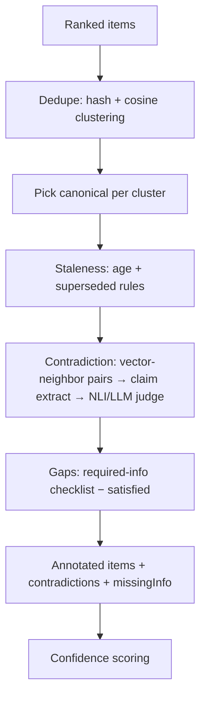
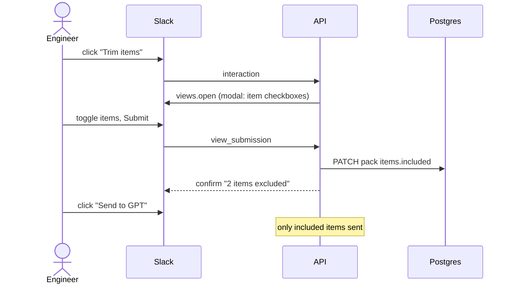
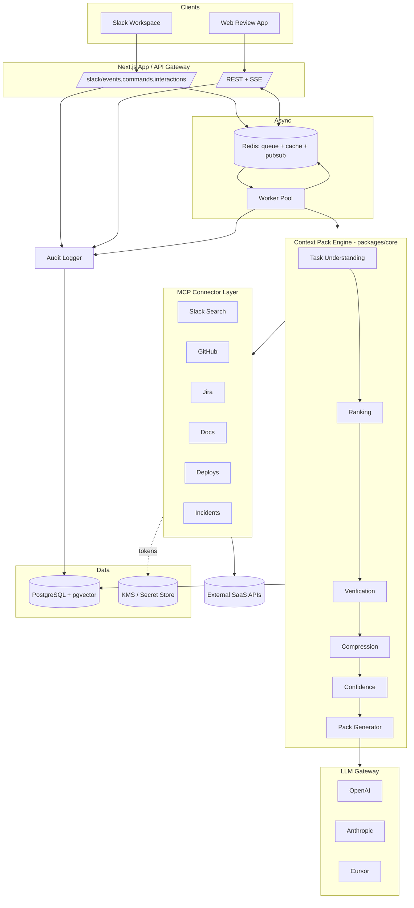
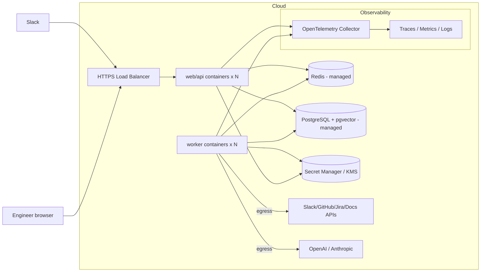
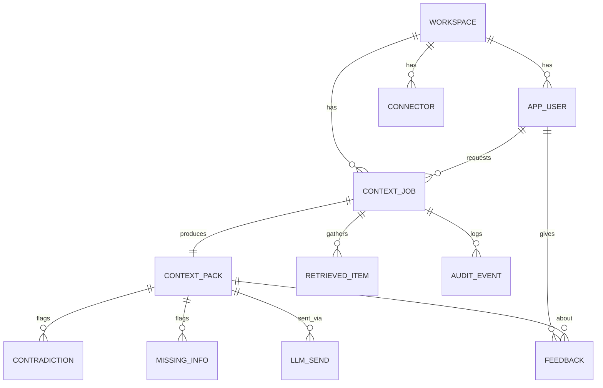
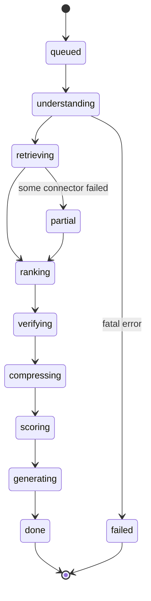
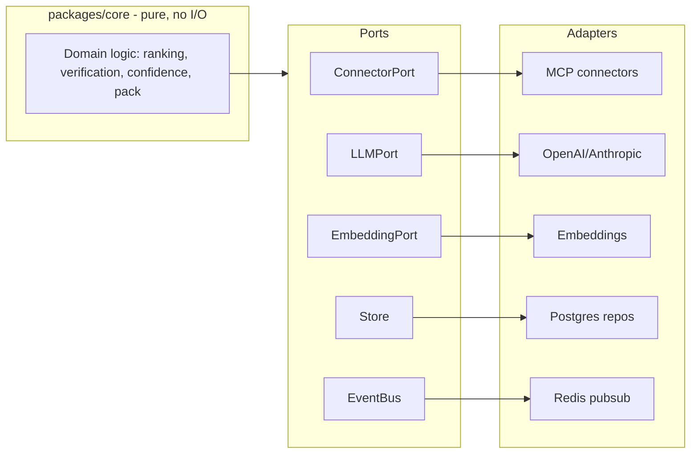

# 05 — Sequence & Architecture Diagrams

- [19. Sequence Diagrams](#19-sequence-diagrams)
- [20. Architecture Diagrams](#20-architecture-diagrams)

All diagrams are Mermaid; they render in GitHub/GitLab and most Markdown viewers.

---

## 19. Sequence Diagrams

### 19.1 End-to-end: Task → Context Pack → Send to AI

### 19.2 Retrieval fan-out with graceful degradation

### 19.3 Verification stage (internal)

### 19.4 Slack interaction: trim items before send

---

## 20. Architecture Diagrams

### 20.1 Logical system architecture

### 20.2 Deployment view

### 20.3 Data model (ER) overview

### 20.4 Request lifecycle / state machine

### 20.5 Hexagonal module boundaries

